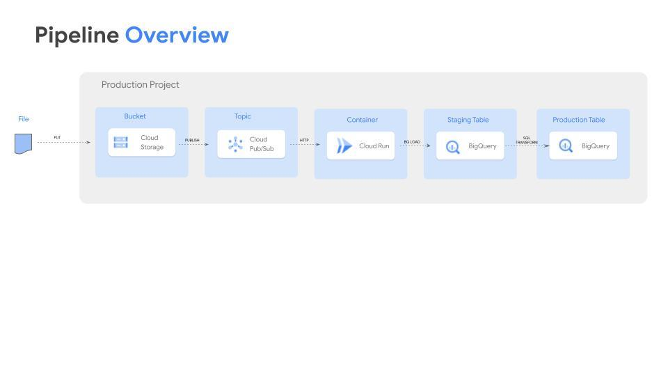

# GCS to BigQuery in Python

This is a Python code which is taking data deployed into GCS, building a schema and a table in BQ and inserting the data into the table
The code is build using Cloud Build and deployed as a container into Cloud Registry. Every change in the code will trigger the build for a new version of the Container.
It is then Deployed and run in Cloud Run in a serverless environment

# Repository structure

The main files in this repository are:

* `main.py` python code
* `Dockerfile` specifies how the application is built and packaged
* `cloudbuild.yaml` Cloud Build YAML file that is building the container, pushing it to Cloud Registry and deploying it into Cloud Run

